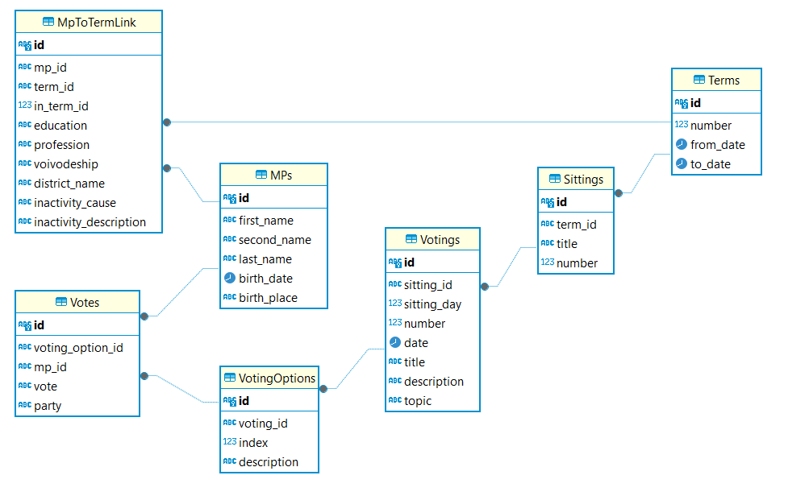

# Sejm Scraper

[](https://python-poetry.org/)
[](https://github.com/astral-sh/ruff)
[](https://github.com/psf/black)
[](https://pycqa.github.io/isort/)
[](https://mypy-lang.org/)
[](https://github.com/LuxF3rre/sejm_scraper/actions/workflows/python.yml)

## Overview

The [Sejm API](https://api.sejm.gov.pl/) facilitates access to comprehensive details about the terms, sittings, votings, votes, and MPs of the [Polish Sejm](https://en.wikipedia.org/wiki/Sejm). However, it presents several challenges:

- Absence of primary and foreign keys.
- API documentation does not specify nullable constraints.
- Inconsistent handling of votings that involve single or multiple voting options.
- MPs are defined per term rather than being treated as continuous entities across different terms.

These limitations can hinder efficient data analysis as the API's response times are slow and it necessitates a high volume of requests, which is time-consuming.

To address these issues, the following solutions have been implemented:

- Creation of a database that includes tables with [natural keys](https://en.wikipedia.org/wiki/Natural_key), utilizing SHA-256 for hashing and enforced key constraints.
- Implementation of API response schema validation alongside stringent null constraints within the database.
- Normalization of votings to accommodate single-option scenarios uniformly.
- Refinement of MP entries into a global entity spanning multiple terms.

Furthermore, maintaining a local copy of the data ensures rapid access to the entire dataset, significantly enhancing analysis capabilities.

### Data quality notes

The Sejm API models MPs on a term-by-term basis rather than maintaining a continuous, global MP entity. In contrast, the enhanced data model treats each MP as a global object. This difference introduces potential duplication in our data due to various inconsistencies originating from the Sejm API, including:

- Data entry errors, such as typos or inconsistent naming of birthplaces.
- Changes in an MP's last name, commonly due to marriage.
- Previously missing fields that have been added later and are integral to our primary key, like birthplace.

To ensure accurate and reliable analysis, it's crucial to deduplicate these entries.

## Features

- [x] Built with **🐍Python** and **Postgres** on **🐋Docker**.
- [x] Normalized data model with primary keys, foreign keys, and not null constrains.
- [x] Fast and realiable processing thanks to the custom client for [Sejm API](https://api.sejm.gov.pl/sejm/openapi/ui).
- [x] Able to resume work from a given term, sitting, and voting.

## Data model



## Installation & usage

### 0. Requirements:

- Python 3.12
- [Poetry](https://python-poetry.org/) (optional)
- [Docker Desktop](https://www.docker.com/products/docker-desktop/) (not required if you have Postgres database ready)

### 1. **Clone the repository:**

```console
https://github.com/LuxF3rre/sejm_scraper
```

### 2. Navigate to the project directory:

```console
cd sejm_scraper
```

### 3. Install dependencies:

```console
pip install -r requirements.txt
```

For development requirements as well:

```console
pip install -r requirements-dev.txt
```

If you have poetry:

```console
poetry shell
poetry install
```

For development requirements as well:

```console
poetry shell
poetry install --with dev
```

### 4. Set up the database:

If you don't have Postgres database ready run:

```console
docker-compose up -d
```

If you have Postgres database ready set the connection through these environmental variables:

- `SEJM_SCRAPER_HOST`
- `SEJM_SCRAPER_PORT`
- `SEJM_SCRAPER_DATABASE`
- `SEJM_SCRAPER_USER`
- `SEJM_SCRAPER_PASSWORD`

### 5. Create tables in the database:

```console
python ./src/sejm_scraper/main.py prepare-database
```

If you have poetry:

```console
sejm-scraper prepare-database
```

### 6. Start scraping:

```console
python ./src/sejm_scraper/main.py scrape
```

If you have poetry:

```console
sejm-scraper scrape
```

### 7. Resume scraping:

```console
python ./src/sejm_scraper/main.py scrape --from-point term[,sitting[,voting]]
```

If you have poetry:

```console
sejm-scraper scrape --from-point term[,sitting[,voting]]
```

### 8. See help:

```console
python ./src/sejm_scraper/main.py --help
```

If you have poetry:

```console
sejm-scraper --help
```

## Limitations

This project's scope is constrained by the data availability from the Sejm API:

1. Absence of MP data for term 2.
2. Limited to only term and MP data for terms 3 through 7 and votes data from term 8 onwards.
3. Absence of exact dates of becoming active or inactive for MPs as well as changing the party.

To address the first two gaps, future development efforts should aim to source the missing data directly from the Sejm's official website. The data is not exposed directly on the webpage, but can be obtained by using the following URL pattern:

`https://sejm.gov.pl/sejm10.nsf/agent.xsp?symbol=glosowania&NrKadencji={term_number}&NrPosiedzenia={sitting_number}&NrGlosowania={voting_number}`

For example:

`https://sejm.gov.pl/sejm10.nsf/agent.xsp?symbol=glosowania&NrKadencji=3&NrPosiedzenia=6&NrGlosowania=2`

## References

Sejm API:

- [ELI & Sejm API documentation](https://api.sejm.gov.pl/)
- [API for Polish Sejm Swagger UI](https://api.sejm.gov.pl/sejm/openapi/ui)

Similar projects:

- [Sejm VIII Kadencji](https://github.com/prokulski/sejm_viii_kadencji/)

## Contributing

Pull requests are welcome. For major changes, please open an issue first to discuss what you would like to change.

## License

MIT License
