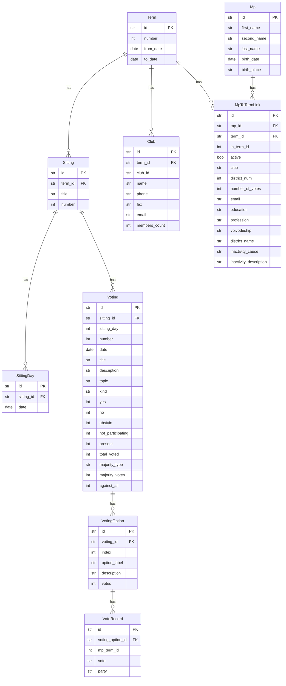

# Sejm Scraper

[](https://deepwiki.com/LuxF3rre/sejm_scraper)
[](https://github.com/astral-sh/uv)
[](https://github.com/astral-sh/ruff)
[](https://github.com/astral-sh/ty)
[](https://github.com/LuxF3rre/sejm_scraper/actions/workflows/test.yml)
[](https://codecov.io/gh/LuxF3rre/repo-sejm_scraper)

## What is this?

The [Sejm API](https://api.sejm.gov.pl/) gives you access to terms, sittings, votings, votes, and MPs of the [Polish Sejm](https://en.wikipedia.org/wiki/Sejm). Unfortunately, working with it directly is painful:

- No primary or foreign keys — you're on your own linking things together.
- Nullable fields are undocumented — you find out at runtime.
- Single-option and multi-option votings are handled inconsistently.
- MPs are scoped per term, so the same person gets a new identity every election.
- Older terms have missing or contradictory data (see [API quirks](#api-quirks)).
- The API is slow and requires thousands of requests to get everything.

This scraper downloads all that data into a local [DuckDB](https://duckdb.org/) database with proper keys, constraints, and a normalized schema — so you can actually analyze it.

### What it does

- Generates [natural keys](https://en.wikipedia.org/wiki/Natural_key) (SHA-256) for every record, with enforced foreign keys and not-null constraints.
- Validates every API response with Pydantic before storing anything.
- Normalizes multi-option votings so single-option and multi-option cases look the same.
- Merges MP identities across terms into a single global entity.
- Discovers sittings from the voting table when the proceedings endpoint is empty (terms 3-6).
- Reconciles voting options from detail endpoints to handle list/detail inconsistencies.

### A note on MP deduplication

The API models MPs per term — the same person gets a different ID each time. This scraper creates a global `Mp` record keyed by `(first_name, last_name, birth_date, birth_place)`, but this can produce duplicates when:

- There are typos or inconsistencies in birthplace names.
- An MP changes their last name (e.g. after marriage).
- A previously missing field (like birthplace) gets backfilled later.

You'll want to deduplicate these if you're doing cross-term analysis.

## Documentation

Full project documentation is available at [DeepWiki](https://deepwiki.com/LuxF3rre/sejm_scraper).

## Features

- Normalized data model with primary keys, foreign keys, and not-null constraints.
- Async HTTP with unlimited concurrent vote scraping per sitting.
- Retry logic for flaky API responses.
- Embedded DuckDB — no database server needed.
- Resume from any term, sitting, or voting.

## Tech stack

- **Python 3.12+**
- **DuckDB** — embedded analytical database
- **SQLModel** — ORM layer
- **Pydantic v2** — API response validation
- **httpx** — async HTTP client
- **anyio** — structured concurrency
- **tenacity** — retry logic
- **loguru** — structured logging
- **ruff** — linting and formatting
- **ty** — type checking
- **uv** — package management

## Data model



## Getting started

### Requirements

- Python 3.12+
- [uv](https://docs.astral.sh/uv/)

### Install

```console
git clone https://github.com/LuxF3rre/sejm_scraper
cd sejm_scraper
uv sync
```

For development dependencies:

```console
uv sync --all-groups
```

### Scrape

Create the database and start scraping:

```console
uv run sejm-scraper prepare-database
uv run sejm-scraper scrape
```

Or start from a specific point:

```console
uv run sejm-scraper scrape --from-term 10
uv run sejm-scraper scrape --from-term 10 --from-sitting 5
uv run sejm-scraper scrape --from-term 10 --from-sitting 5 --from-voting 3
```

### Resume

Pick up where you left off:

```console
uv run sejm-scraper resume
```

### Help

```console
uv run sejm-scraper --help
```

## Accessing the data

### Prerequisites

- [DuckDB CLI](https://duckdb.org/docs/installation/)

### Open the database

```console
duckdb sejm_scraper.duckdb
```

### Query the data

For example, to see the number of sittings per term:

```sql
SELECT
  terms.number AS term_number,
  COUNT(*) AS number_of_sittings
FROM
  sitting AS sittings
  LEFT JOIN term AS terms ON sittings.term_id = terms.id
GROUP BY
  terms.number;
```

## API quirks

The Sejm API has a number of undocumented quirks that this scraper works around. Documented here so you don't have to discover them the hard way.

### Missing data per term

Not all terms have the same data. Term 1 isn't even listed, and term 2 is a ghost — the API acknowledges it exists but returns nothing.

| Term | MPs | Proceedings | Voting table | Votings/Votes |
|------|-----|-------------|--------------|---------------|
| 1 | Not listed | - | - | - |
| 2 | Empty | Empty | Empty | - |
| 3-6 | Yes | Empty | Yes | Yes |
| 7+ | Yes | Yes | Yes | Yes |

### No proceedings for terms 3-6

The proceedings endpoint (`/term{N}/proceedings`) returns `[]` for terms 3-6, but voting data does exist at `/term{N}/votings/{sitting}`. The scraper discovers sittings from the `/term{N}/votings` flat table (which maps dates to proceeding numbers) and creates synthetic `Sitting`/`SittingDay` records. The trade-off: sitting titles are generic (`"Posiedzenie nr {N}"`) instead of official names.

### Duplicate voting numbers within a sitting

Some sittings in older terms have multiple votings with the same `votingNumber` but different `sittingDay`, `date`, and `kind` values. For example, term 3, sitting 15 has two completely different votings both numbered 7 — one is an ON_LIST vote, the other is ELECTRONIC. The detail endpoint only returns one of them, so the scraper reconciles voting options per `database.Voting` individually to keep foreign keys consistent.

### List and detail endpoints disagree on voting options

For some votings, the list endpoint says `votingOptions: null`, but when you fetch the detail endpoint, the individual votes have `listVotes` (multi-option structure). The scraper always builds voting options from the detail endpoint in addition to the list endpoint, using `INSERT OR REPLACE` to merge them.

### Undocumented vote values in older terms

Older terms use vote values not present in newer terms and not documented in the API schema:

- `NO_VOTE` (terms 3-5) — MP was present but did not cast a vote.
- `VOTE_INVALID` — MP's vote was invalidated.

### Single-option and multi-option votings are mixed

The API uses two different structures for vote data depending on the voting kind. In single-option votings (e.g. `ELECTRONIC`), each MP's `vote` field is one of `YES`, `NO`, `ABSTAIN`, `ABSENT`, etc., and `listVotes` is `null`. In multi-option votings (e.g. `ON_LIST`), `vote` is `VOTE_VALID` and the actual per-option votes live in `listVotes` — a dict mapping option indices to vote values. There's no flag that tells you which structure to expect; you have to check whether `listVotes` is present. The scraper normalizes both cases into the same `VotingOption`/`VoteRecord` schema — single-option votings get a synthetic default option with index 1.

### MP inactivity fields are inconsistent

Active MPs have both `inactiveCause` and `waiverDesc` set to `null`. For inactive MPs, you'd expect both fields to be present — but sometimes only `waiverDesc` (mapped to `inactivity_description`) is set while `inactiveCause` is `null`. The two fields don't have a documented relationship, and you can't rely on one implying the other.

### Club IDs may not match the clubs endpoint

The `club` field on MPs and the `club` field on individual votes reference a club ID (e.g. `"KO"`, `"PiS"`). The `/term{N}/clubs` endpoint lists clubs for each term, but some club IDs that appear in vote or MP data may not have a corresponding entry in the clubs endpoint — especially in older terms. The scraper stores clubs as a best-effort reference table without foreign key constraints from votes or MPs.

### Planned sittings have number 0

The proceedings endpoint sometimes returns sittings with `number: 0`. These represent planned (future) sittings that haven't happened yet and have no associated votings. The scraper filters these out automatically, since they contain no useful data and would pollute the sitting table.

### MPs are per-term entities

The API gives each MP a term-scoped `id`. Serve three terms, get three different IDs. This scraper creates a global `Mp` record keyed by name and birth info, but see the [deduplication note](#a-note-on-mp-deduplication) above.

## Limitations

1. Terms 1 and 2 have no usable data in the API. There's no workaround.
1. Sitting titles for terms 3-6 are synthetic — the API doesn't provide the real ones.
1. The API doesn't track when MPs became active/inactive or switched parties.

## References

- [ELI & Sejm API documentation](https://api.sejm.gov.pl/)
- [API for Polish Sejm Swagger UI](https://api.sejm.gov.pl/sejm/openapi/ui)
- [Sejm VIII Kadencji](https://github.com/prokulski/sejm_viii_kadencji/) — similar project

## Contributing

Pull requests are welcome. For major changes, please open an issue first to discuss what you would like to change.

## License

MIT License
