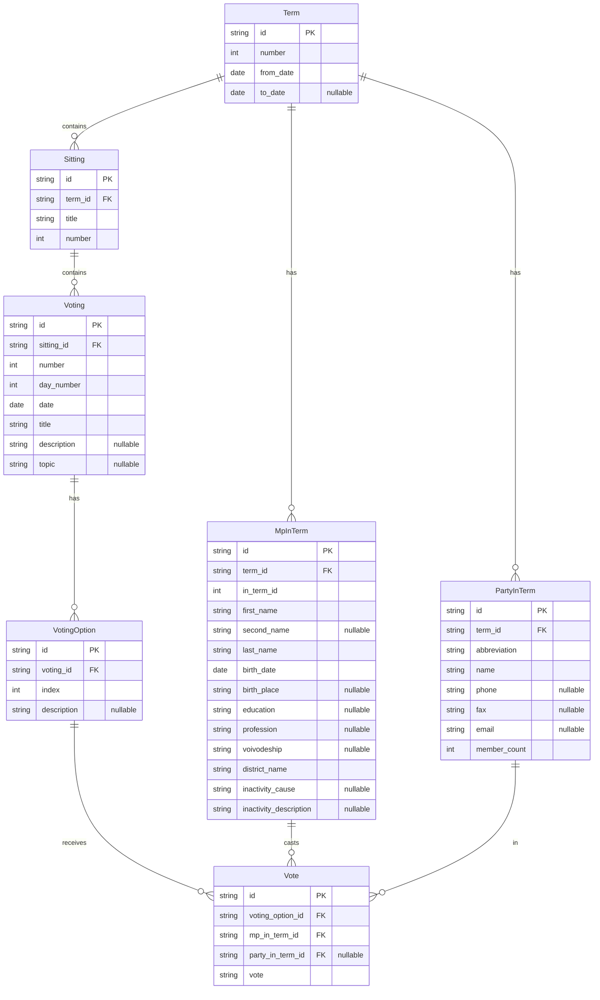

# Sejm Scraper

[](https://github.com/astral-sh/uv)
[](https://github.com/astral-sh/ruff)
[](https://github.com/psf/black)
[](https://pycqa.github.io/isort/)
[](https://github.com/astral-sh/ty)
[](https://github.com/LuxF3rre/sejm_scraper/actions/workflows/test.yml)

## Overview

### Problem

The [Sejm API](https://api.sejm.gov.pl/) provides access to details about the terms, sittings, votings, votes, MPs, and parties of the [Polish Sejm](https://en.wikipedia.org/wiki/Sejm). However, it presents several challenges:

- Lack of bulk data download option.
- Absence of primary and foreign keys.
- API documentation does not specify nullable constraints.
- Inconsistent handling of votings that involve single or multiple voting options.
- MPs and parties are defined per term rather than being treated as continuous entities across different terms.

### Solution

- Scraper that downloads Sejm API entries on terms, sittings, votings, votes, MPs, and parties.
- Database that includes tables with [natural keys](https://en.wikipedia.org/wiki/Natural_key), utilizing SHA-256 for hashing and enforced key constraints.
- Schema validation of API responses alongside null constraints within the database.
- Normalization of votings to accommodate single-option scenarios uniformly.

## Features

- [x] Built with **🐍Python** and **🦆DuckDB**.
- [x] Normalized data model with primary keys, foreign keys, and not null constrains.
- [x] Reliable processing thanks to the custom client for [Sejm API](https://api.sejm.gov.pl/sejm/openapi/ui).
- [x] Able to resume work from latest downloaded and a given term, sitting, and voting.

## Data model



## Installation & usage

### Scraping

#### 0. Requirements for scraping

- git
- Python 3.12 or uv or devenv

#### 1. Clone and navigate into the repository

```console
git clone https://github.com/LuxF3rre/sejm_scraper && cd sejm_scraper
```

#### 2. Install dependencies

```console
pip install -r requirements.txt
```

If you have uv:

```console
uv sync
```

If you have devenv, allow direnv:

```console
direnv allow
```

#### 3. Prepare the database

```console
sejm-scraper prepare-database
```

#### 4. Start scraping

```console
sejm-scraper start-pipeline
```

#### 5. Resume scraping

##### From the latest available point in the database

```console
sejm-scraper resume-pipeline
```

##### From a specific point

```console
sejm-scraper resume-pipeline --term <number> [--sitting <number> [--voting <number>]]
```

#### 6. See help, if needed

```console
sejm-scraper --help
```

### Accessing the data

#### 0. Requirements for accessing the data

- duckdb

#### 1. Launch duckdb and open the database

```console
duckdb
.open sejm_scraper.duckdb
```

#### 2. Query the data

You may now query it, for example to see the number of sittings per term:

```sql
SELECT
  terms.number AS term_number,
  COUNT(*) AS number_of_sittings
FROM
  sitting AS sittings
  LEFT JOIN term AS terms ON sittings.term_id = terms.id
GROUP BY
  terms.number;
```

## Limitations

### Data

The Sejm API models MPs and parties on a term-by-term basis rather than maintaining a continuous, global entities. Turning them into continuous entities is not a trival issue due to various inconsistencies originating from the Sejm API, including:

- Data entry errors, such as typos or inconsistent naming of birthplaces.
- Changes in an MP's last name, commonly due to marriage.
- Previously missing fields that have been added later and are integral to make a primary key, like birthplace.

### Scope

The scope is constrained by the data availability from the Sejm API:

1. Absence of MP data for term 2.
2. Limited to only term and MP data for terms 3 through 7 and votes data from term 8 onwards.
3. Lack of temporal tracking, resulting for example in the absence of exact dates of becoming active or inactive for MPs as well as changing the party.

To address the first two gaps, future development efforts should aim to source the missing data directly from the Sejm's official website. The data is not exposed directly on the webpage, but can be obtained by using the following URL pattern:

`https://sejm.gov.pl/sejm10.nsf/agent.xsp?symbol=glosowania&NrKadencji={term_number}&NrPosiedzenia={sitting_number}&NrGlosowania={voting_number}`

For example:

`https://sejm.gov.pl/sejm10.nsf/agent.xsp?symbol=glosowania&NrKadencji=3&NrPosiedzenia=6&NrGlosowania=2`

To address the third gap, future development should focus on implementing a data warehouse that would track temporal changes with scheduled loads and schema capturing changes in time, e.g. [Data Vault 2.0](https://en.wikipedia.org/wiki/Data_vault_modeling).

## Developing

To develop, ensure you have [devenv](https://devenv.sh/) installed.

Then, clone and enter the repository.

```console
git clone https://github.com/LuxF3rre/sejm_scraper && cd sejm_scraper
```

And allow direnv to install all required development dependencies.

```console
direnv allow
```

## Contributing

Pull requests are welcome. For major changes, please open an issue first to discuss what you would like to change.

## References

Sejm API:

- [ELI & Sejm API documentation](https://api.sejm.gov.pl/)
- [API for Polish Sejm Swagger UI](https://api.sejm.gov.pl/sejm/openapi/ui)

Similar projects:

- [Sejm VIII Kadencji](https://github.com/prokulski/sejm_viii_kadencji/)

## License

MIT License
